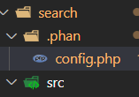

#### Install PHPCodeSniffer

``` shell
composer require --dev squizlabs/php_codesniffer

```
#### Acessando painel de comandos

```shell
D:\Projects\php_fundamentals\composer> vendor\bin\phpcs --help
```
#### Identificando possiveis erros de sintaxe

```shell
D:\Projects\php_fundamentals\composer> vendor\bin\phpcs --standard=PSR12 search\src\
```

#### Install Phan

```shell
composer require --dev phan\phan
```
#### Acessando comandos disponíveis
```shell
D:\Projects\php_fundamentals\composer> vendor\bin\phan --help
```

#### Análisando código

```shell
vendor\bin\phan --allow-polyfill-parser search\src\functions.php

```
#### Crie o arquivo de configuração do phan


### Install PhpUnit
```shell
composer require --dev phpunit/phpunit

```
### Como executar testes phpUnit

```shell
vendor\bin\phpunit Tests\SearchCourses.php
```

### Configurando Scripts no Composer JSON

```json
"scripts": {
    "test": "phpunit Tests\\SearchCoursesTest.php",
    "cs": "phpcs --standard=PSR12 src/"

    }
```

#### Criando script de scripts
```json
"scripts": {
    "test": "phpunit Tests\\SearchCoursesTest.php",
    "cs": "phpcs --standard=PSR12 src/"

    },
    "check":[
        
        "@phan",
        "@cs",
        "@test",
    ]
```

### Run Scripts 

```shell
composer check
```

#### Adicionando descrição a um script

```json
 "scripts-descriptions": {
        "check":"Run verify code PHAN,PHPCS,PHUNIT "
    }
```